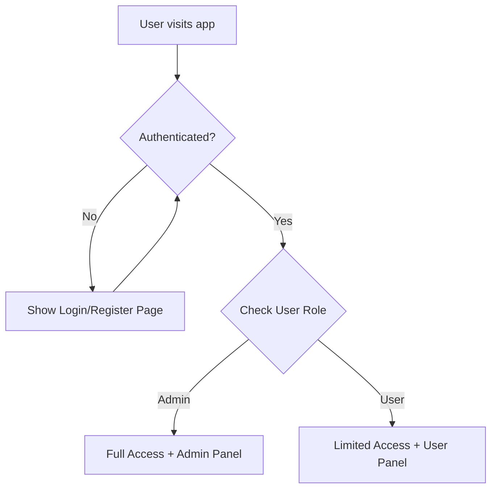

# 🔐 Authentication System Setup Guide

## Overview
The Document Q&A Assistant now includes a complete authentication system with role-based access control. Users must login first, then get appropriate access based on their role.

## 🚀 Quick Setup

### Step 1: Install Dependencies
```bash
pip install bcrypt==4.1.2
```

### Step 2: Set Up Database
Run the database migration script to create the users table:
```bash
python create_users_table.py
```

This script will:
- Create the `users` table with proper schema
- Create a default admin user (you'll be prompted for credentials)
- Set up necessary indexes for performance

### Step 3: Test Authentication
Run the test script to verify everything works:
```bash
python test_auth.py
```

### Step 4: Run the Application
```bash
streamlit run 5-chat.py
```

## 🔑 Default Admin Account

When you run `create_users_table.py`, you'll be prompted to create a default admin user. This admin account is required for:
- API configuration
- User management
- System administration

**Keep these credentials secure!**

## 👥 User Roles & Permissions

### Admin Users
- ✅ **API Configuration**: Set up OpenAI/Mistral API keys
- ✅ **User Management**: Create, edit, deactivate user accounts
- ✅ **Full Document Access**: Upload, process, and manage all documents
- ✅ **Database Management**: Access to all database operations
- ✅ **System Settings**: Configure application settings

### Regular Users
- ✅ **Document Upload**: Upload and manage their own documents
- ✅ **Document Processing**: Extract, chunk, and embed their documents
- ✅ **Chat/Q&A**: Ask questions about their processed documents
- ❌ **API Configuration**: Cannot access API key settings
- ❌ **User Management**: Cannot manage other users
- ✅ **Personal Documents**: Only see their own uploaded documents

## 🔐 Authentication Flow



## 📁 File Structure

```
├── 5-chat.py              # Main application (modified for auth)
├── auth_utils.py          # Authentication utilities
├── login_page.py          # Login/register UI components
├── user_management.py     # Admin user management interface
├── create_users_table.py  # Database migration script
├── test_auth.py          # Authentication test script
├── plan.md               # Implementation plan
└── AUTH_README.md        # This file
```

## 🔧 Configuration

### Environment Variables
Make sure your `.env` file includes:
```env
NEON_CONNECTION_STRING=your_neon_database_url
OPENAI_API_KEY=your_openai_key (admin configures)
MISTRAL_API_KEY=your_mistral_key (admin configures)
```

### Database Schema
The `users` table includes:
- `id`: Primary key
- `username`: Unique username
- `password_hash`: Bcrypt hashed password
- `email`: Optional email address
- `role`: 'admin' or 'user'
- `created_at`: Account creation timestamp
- `last_login`: Last login timestamp
- `is_active`: Account status

## 🛠️ Usage Guide

### For Administrators

1. **Login** with your admin credentials
2. **Configure APIs** in the sidebar (admin only)
3. **Manage Users** in the "👥 User Management" tab
4. **Process Documents** using the document processing features
5. **Monitor System** through database management tools

### For Regular Users

1. **Register** a new account or login with existing credentials
2. **Upload Documents** using the sidebar upload features
3. **Process Documents** with extract → chunk → embed
4. **Ask Questions** about your processed documents in the chat

## 🔒 Security Features

- **Password Hashing**: Bcrypt with salt for secure password storage
- **Session Management**: Streamlit session state for user sessions
- **Role-Based Access**: Different permissions based on user role
- **Input Validation**: Username, email, and password validation
- **Account Security**: Active/inactive account status management

## 🚨 Troubleshooting

### Common Issues

1. **"Database connection failed"**
   - Check `NEON_CONNECTION_STRING` in your `.env` file
   - Verify your Neon database is running and accessible

2. **"Users table doesn't exist"**
   - Run `python create_users_table.py` to create the table

3. **"Access denied" errors**
   - Make sure you're logged in with appropriate role
   - Check if your account is active

4. **Password validation errors**
   - Password must be 8+ characters
   - Must include uppercase, lowercase, number, and special character

### Debug Steps

1. Run `python test_auth.py` to test all components
2. Check database connection with `python -c "from auth_utils import get_db_connection; print(get_db_connection())"`
3. Verify user creation with `python -c "from auth_utils import create_user; print(create_user('test', 'TestPass123!', 'test@example.com'))"`

## 🔄 Migration from Old Version

If you're upgrading from the previous version:

1. **Backup your database** (important!)
2. Run `python create_users_table.py` to add the users table
3. Create an admin account during the setup process
4. Test with `python test_auth.py`
5. Run your application with the new authentication system

## 📞 Support

For issues with the authentication system:
1. Check the troubleshooting section above
2. Run the test script: `python test_auth.py`
3. Verify database connectivity
4. Check the Streamlit console for error messages

---

**🎉 Your Document Q&A Assistant now has secure authentication!**