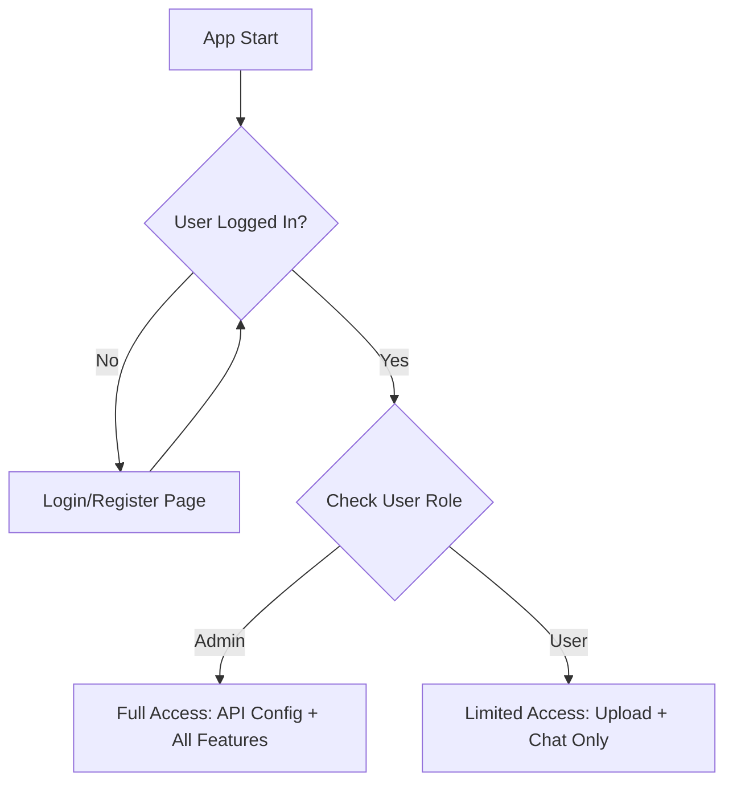

# Login System Implementation Plan

## Overview
Add a complete authentication system to the Document Q&A Assistant with role-based access control.

## Requirements
- **Authentication Type**: Username/password with database-backed users
- **User Registration**: Allow users to create accounts + admin user creation
- **Roles**: Admin (full access) vs User (upload + chat only)
- **Flow**: Login page first, then role-based access

## Database Schema
```sql
CREATE TABLE users (
    id SERIAL PRIMARY KEY,
    username VARCHAR(50) UNIQUE NOT NULL,
    password_hash VARCHAR(255) NOT NULL,
    email VARCHAR(255) UNIQUE,
    role VARCHAR(20) DEFAULT 'user' CHECK (role IN ('admin', 'user')),
    created_at TIMESTAMP DEFAULT CURRENT_TIMESTAMP,
    last_login TIMESTAMP,
    is_active BOOLEAN DEFAULT TRUE
);
```

## Application Flow


## Implementation Phases

### Phase 1: Database & Core Auth
- [ ] Create database migration script for users table
- [ ] Add bcrypt dependency to requirements.txt
- [ ] Create authentication utilities (hash_password, verify_password, create_user, authenticate_user)

### Phase 2: Authentication UI
- [ ] Create login page component with form validation
- [ ] Create user registration page component
- [ ] Add session management for logged-in users
- [ ] Implement logout functionality

### Phase 3: Role-Based Access Control
- [ ] Modify main app flow to check authentication first
- [ ] Implement role checks throughout the application
- [ ] Restrict API configuration to admin users only
- [ ] Hide admin features from regular users

### Phase 4: Admin Features
- [ ] Create admin user management interface
- [ ] Add user creation, editing, deactivation functionality
- [ ] Implement user-specific document isolation

### Phase 5: Testing & Polish
- [ ] Test complete authentication flow
- [ ] Verify role-based access control
- [ ] Test user management features
- [ ] Update documentation

## Security Considerations
- Password hashing with bcrypt
- Session-based authentication
- Input validation and sanitization
- SQL injection prevention
- Role-based access control

## Files to Modify/Create
- `requirements.txt` - Add bcrypt
- `5-chat.py` - Main authentication integration
- `auth_utils.py` - Authentication utilities (new)
- `user_management.py` - Admin user management (new)
- Database migration script

## User Roles & Permissions

### Admin Users
- ✅ API configuration and management
- ✅ User management (create, edit, deactivate users)
- ✅ All document processing features
- ✅ Database management
- ✅ System administration

### Regular Users
- ✅ Document upload and management
- ✅ Document processing (extract, chunk, embed)
- ✅ Chat/Q&A functionality
- ❌ API configuration access
- ❌ User management
- ✅ Their own uploaded documents only

## Implementation Notes
- Maintain backward compatibility where possible
- Use Streamlit session state for user sessions
- Store user info in session state after login
- Check authentication at app start
- Show appropriate UI based on user role